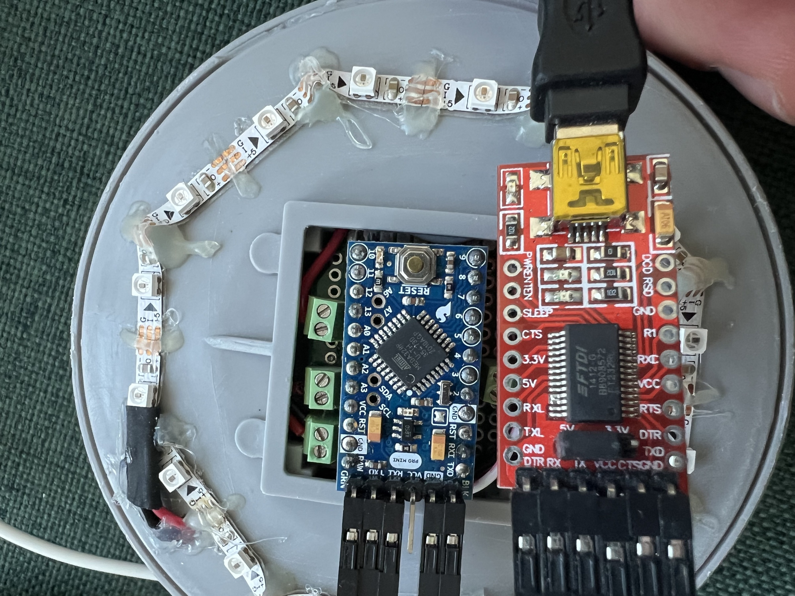
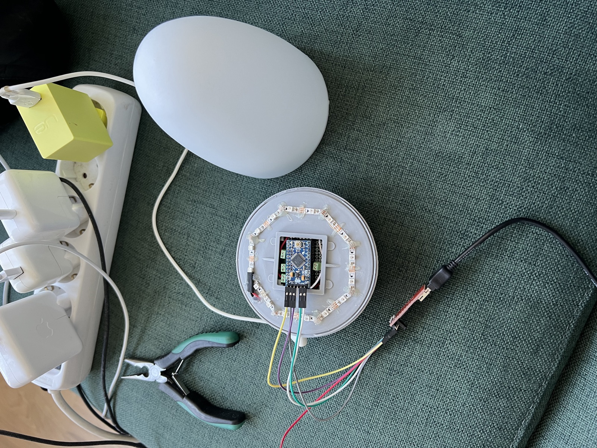
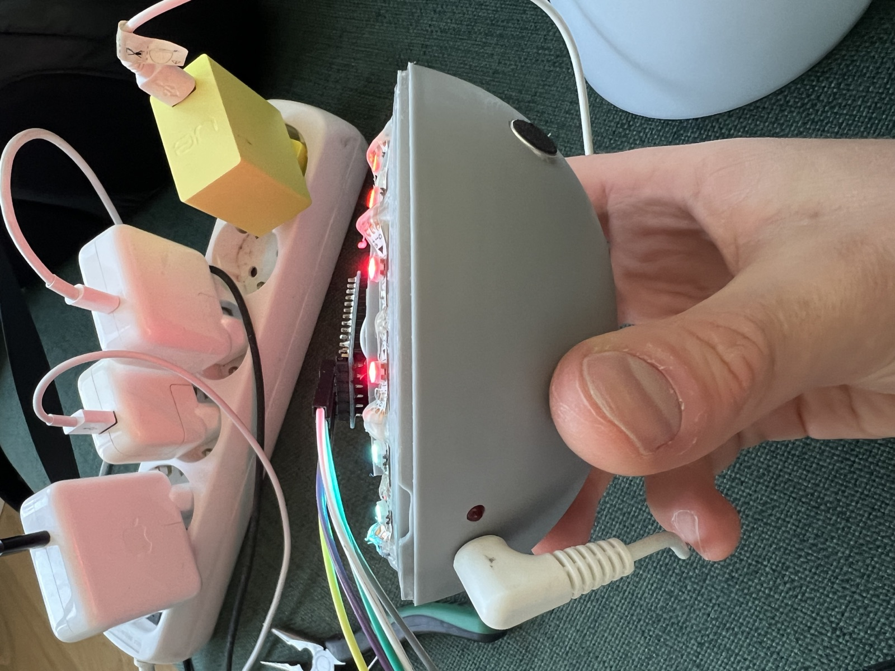
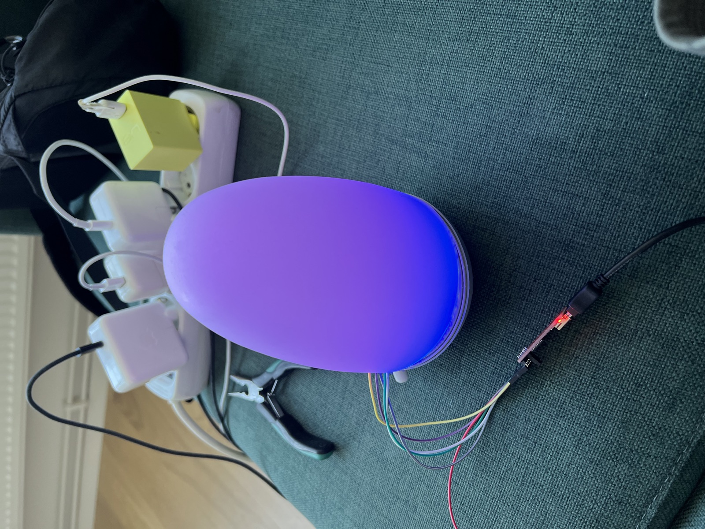
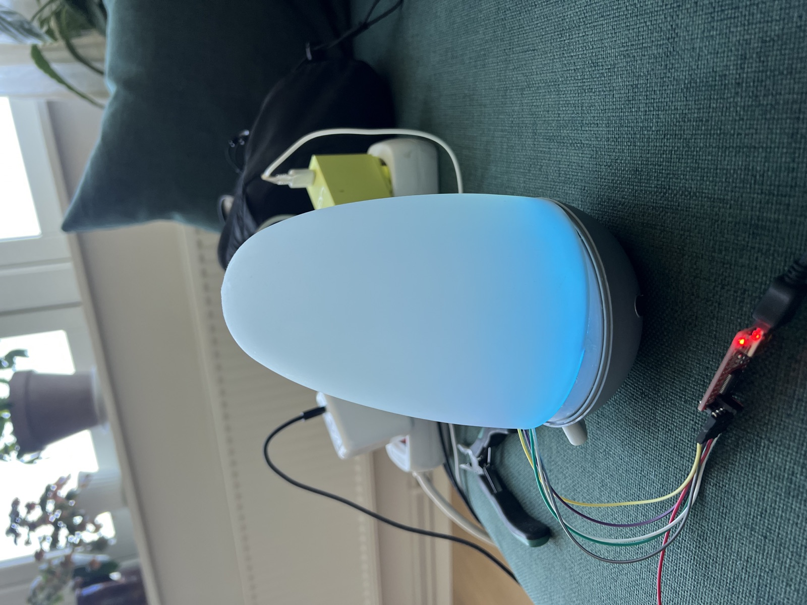
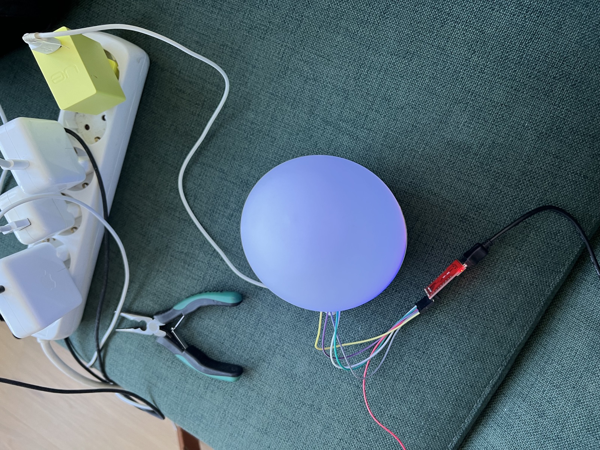

# Lampe

A hobby RGB lamp project with Arduino firmware for animated colors and experiments
with sound-reactive lighting. The lamp in the photos is **Lampe Mini**: a ring of
addressable LEDs inside a rounded, frosted diffuser, with a Pro Mini controller in
the base. This is the repository's sole firmware project, maintained at the root
in [`src/`](src/) and [`lib/`](lib/).

## For humans: connecting the lamp

**The lamp needs its separate 5 V power supply to light up, even when the FTDI
adapter is connected to USB.** Connect the lamp's normal power lead to the socket
in the base. The FTDI adapter provides the programming/serial connection; in the
photographed setup its VCC lead is deliberately disconnected from the controller.

### FTDI wiring

Remove the diffuser to reach the blue Pro Mini's six-pin programming header. Use
the pin labels and the close-up below to orient the connectors. With the boards
facing as in the photo (Pro Mini reset button on the right, programming header on
the left), the Pro Mini header runs from `GRN` at the top to `BLK` at the bottom:

| Pro Mini header, top to bottom in the photo | FTDI adapter connection | Purpose |
| --- | --- | --- |
| `GRN` / DTR | `DTR` | Automatic reset for uploading |
| `TXO` | `RX` / `RXD` | Controller transmit to adapter receive |
| `RXI` | `TX` / `TXD` | Adapter transmit to controller receive |
| `VCC` | **Leave disconnected** | Use the lamp's separate supply |
| `GND` | `CTS` | Grounded CTS in the pictured six-pin arrangement |
| `BLK` / GND | `GND` | Common ground between the lamp and adapter |

The visible gap between the three upper and two lower connectors is the unused
`VCC` pin. `GRN` and `BLK` are board markings, not the colors of these jumper wires.
Match signals if using another adapter, since its pin order may differ. The
[Arduino Pro Mini schematic](https://www.arduino.cc/en/uploads/Main/Arduino-Pro-Mini-schematic.pdf)
shows the programming header's ground connections and capacitive reset circuit.

1. Disconnect power while attaching the jumpers according to the table.
2. Match the adapter's logic voltage to the fitted Pro Mini. The photos identify
   the board as a Pro Mini/ATmega328P, but do not establish its voltage variant.
3. Plug the FTDI adapter's USB cable into the computer and connect the lamp's
   **separate 5 V supply**. Keep FTDI VCC disconnected with this arrangement.
4. Select the adapter’s serial port for uploads or in the local dashboard. The
   firmware streams binary LED snapshots at **115200 baud**; see Live lamp below.

<a href="docs/images/ftdi-wiring.jpg"></a>

*Programming connector close-up. Click any photo to see it at a larger size.*

### What the hardware looks like

| Inside the lamp | Separate power connection |
| --- | --- |
| [](docs/images/lampe-mini-open.jpg) | [](docs/images/lampe-mini-power.jpg) |

The LED strip follows the rim of the base, around the controller and a small
prototype board with screw terminals. The removable diffuser spreads the light
from the ring. The white lead supplies the lamp separately from the FTDI's black
USB cable.

| Assembled, purple | Assembled, blue | View from above |
| --- | --- | --- |
| [](docs/images/lampe-mini-purple.jpg) | [](docs/images/lampe-mini-blue.jpg) | [](docs/images/lampe-mini-overhead.jpg) |

If the FTDI is visible to the computer but the lamp stays dark, first check the
separate 5 V supply. Adapter activity alone does not confirm that the lamp is
powered. For upload problems, check the selected port, crossed TX/RX connections,
common ground, and DTR connection before changing firmware settings.

## For humans: the local lamp studio

The dashboard has two sources for the same 3D view:

- **Simulator** runs the actual C++ effects and FastLED color math in your browser
  using WebAssembly. No lamp is needed. Choose a program and it runs automatically
  while the tab is visible, pausing when you switch away. Audio controls appear
  when Sound reactive is selected.
  Sound reactive accepts a simulated steady or pulsing input, or silence. Set
  Pulse tempo to test beat detection from 60–200 BPM.
- **Live lamp** reads LED snapshots from the FTDI through Web Serial. Use desktop
  Chrome or Edge on localhost, choose Live lamp → Connect lamp, and select the
  adapter. Click a program to change the physical lamp; its button also works. Connect
  the **separate 5 V supply** and upload this repository’s firmware first.

Drag the model to orbit, scroll to zoom, and turn the diffuser off to see the
16 LED ring and controller. Click a pixel below the model (or a visible 3D LED)
for its raw RGB values. The diffuser shape is based on the photos; its light
spread, brightness, and pixel orientation are an approximation, not a calibrated
optical model. Raw pixel values are the actual effect output.

**Sound reactive follows the music’s beat.** Play music near the lamp’s microphone
and allow roughly 5–7 seconds of a clear, steady rhythm. While listening, the lamp
responds to volume; once a tempo is found, it flashes red once per beat. The Sound
panel shows the detected BPM alongside the microphone level. It can hold time
through a brief missing beat, then returns to listening after silence or loss of
a repeating rhythm. Quiet or complex music can take longer or fail to lock, and
strong subdivisions can produce half/double tempo. The detector runs on the lamp;
the browser can select programs and display their live output.

**See what the microphone hears.** Select Sound reactive to reveal the raw
waveform (0–1023 ADC values) and a five-second rhythm timeline. Green shows the
sound attacks used by the detector; orange marks its beat flashes. The range
readout and Clipping badge reveal signals that reach the ADC limits. **Save
capture** downloads the last five seconds as CSV with sample times, raw values,
attack strength and beat state. The simulator shows its actual generated inputs
in the same views, labelled Simulated.

Live capture needs the latest firmware. It streams at most 1,000 timestamped
samples per second while Sound reactive and the dashboard tab are visible, with
gaps shown when batches are dropped. This is a subsampled diagnostic view for
levels and rhythm, not a full-bandwidth audio recording or frequency analysis.
Samples stay in the local browser unless you save a capture.

### Start locally

Requirements: Node.js **22.12+** (24 LTS recommended),
[uv](https://docs.astral.sh/uv/getting-started/installation/), a C++17 compiler,
and Emscripten **6.0.10**. `uv` manages Python and PlatformIO for this repository:

```sh
# From this repository. Installs Python and the locked development tools.
uv sync --locked
# Install the shared FastLED source without building AVR.
uv run --locked pio pkg install --environment nanoatmega328
npm ci

# One-time SDK installation in a sibling directory; skip the clone if installed.
git clone --depth 1 https://github.com/emscripten-core/emsdk.git ../emsdk
uv run --locked python ../emsdk/emsdk.py install "$(cat .emscripten-version)"
uv run --locked python ../emsdk/emsdk.py activate "$(cat .emscripten-version)"
source ../emsdk/emsdk_env.sh

npm run dev
```

Open **http://127.0.0.1:5173**. Everything runs locally; no account, backend service,
or internet connection is needed after installing dependencies. The server binds
only to loopback. If Emscripten is already installed elsewhere, source that SDK’s
`emsdk_env.sh` or set `EMXX=/absolute/path/to/em++`.

Saving a C++ file under `lib/` or `simulator/` rebuilds WebAssembly and reloads the
page. Changes to the web UI use Vite’s normal development reload. A page reload
restarts the simulation and requires reconnecting live serial. Build errors appear
in the terminal; the last successful simulator stays available until a build
succeeds. Stop the server with Ctrl+C.

For a production build and local preview:

```sh
npm run build
npm run preview
# Open http://127.0.0.1:4173
```

Only building needs Emscripten. `dist/` contains the complete static dashboard,
including the compiled lamp engine, and can be served locally after building.

### Connecting the real lamp

Close any serial monitor and upload the current firmware using the instructions
below. Older firmware only logs program numbers and cannot feed the dashboard.
Choose Live lamp and connect the FTDI. Opening the port may reset the controller
once through DTR; allow for the bootloader and one-second firmware startup delay.
A connected port without valid frames produces a power/firmware troubleshooting
message. Disconnect in the dashboard before uploading again.

Program buttons become available once current firmware reports live frames.
The selected card follows the lamp's confirmation, including physical button
changes. Firmware from before app control stays view-only until upgraded.

The lamp keeps running autonomously at up to 120 FPS. It attempts about 30 serial
snapshots per second, skipping any that cannot fit immediately in the transmit
queue. It never waits for a browser or acknowledgements. This adds some CPU/UART
work, but no intentional frame delay. The browser holds the last frame and marks
it stale after 500 ms without data. Cable removal never silently switches to the
simulator. Real hardware timing still needs to be measured.

## Project context for developers and agents

This is a single PlatformIO project targeting Arduino on AVR. It controls 16
WS2812B addressable RGB LEDs through FastLED 3.10.5. A digital button/sensor on D2
cycles through lighting effects; A0 supplies analog audio for
sound-reactive brightness and beat detection. No Git submodules are required. The unused original
TLC5940/capacitive-touch implementation remains available in Git history.

[`platformio.ini`](platformio.ini) retains `board = nanoatmega328`, the existing
bootloader target. **The photographed controller is marked Pro Mini.** A successful
build for the Nano target does not verify the fitted board's clock, voltage or
bootloader. Check the actual controller before changing upload parameters.

### Where to make changes

| File or directory | Responsibility |
| --- | --- |
| [`src/main.cpp`](src/main.cpp) | Starts serial, waits one second, calls `lampe.begin()` from `setup()`, and runs `lampe.update()` from `loop()` |
| [`lib/Lampe/`](lib/Lampe/) | Arduino pin assignments, LED initialization, input polling, frame scheduling and nonblocking telemetry |
| [`lib/LampEngine/`](lib/LampEngine/) | Shared LED buffer, effect/input state, deterministic randomness and hardware-independent configuration |
| [`lib/Programs/ProgramList.def`](lib/Programs/ProgramList.def) | Single registry for firmware dispatch, audio flags and simulator labels |
| [`lib/Programs/Programs.cpp`](lib/Programs/Programs.cpp) | The eight lighting effects |
| [`lib/LampLogic/LampLogic.h`](lib/LampLogic/LampLogic.h) | Hardware-independent brightness arithmetic, audio envelope, debouncing and timing helpers |
| [`lib/Telemetry/Telemetry.h`](lib/Telemetry/Telemetry.h) | Shared packet encoder and capacity-checked serial writer; [protocol specification](docs/telemetry.md) |
| [`lib/Telemetry/Commands.h`](lib/Telemetry/Commands.h) | Bounded serial command parser for program selection |
| [`simulator/`](simulator/) | WebAssembly bridge, virtual clock/ADC inputs, and actual FastLED color implementations |
| [`web/src/`](web/src/) | TypeScript dashboard, Three.js model, serial connection and packet parser |
| [`scripts/build_simulator.py`](scripts/build_simulator.py) | Compiles the engine and FastLED to WebAssembly using pinned Emscripten |
| [`tests/`](tests/) and [`web/tests/`](web/tests/) | Native regressions, C++/WASM parity, serial framing and browser interaction tests |
| [`experiments/beat-detection/`](experiments/beat-detection/) | Archived, unfinished beat detector; excluded from the firmware build |
| [`platformio.ini`](platformio.ini) | Pinned AVR platform, toolchain, Arduino core and FastLED dependency; downloaded libraries live under ignored `.pio/libdeps/` |
| [`pyproject.toml`](pyproject.toml), [`uv.lock`](uv.lock) and [`.python-version`](.python-version) | Python development dependencies, their resolved versions, and the Python version used locally and in CI |

The global `Lampe` object only initializes its data. Hardware calls happen in
`begin()`, after Arduino has initialized its timers. Each loop polls the button
and, in the amplitude mode, takes one ADC sample. LED rendering is paced separately
at up to 120 frames per second, without a frame delay or blocking audio window.
Effect timers and the audio envelope reset when switching modes; the shared hue
and existing LED colors carry through transitions.

### Hardware settings and effects

| Setting | Current value |
| --- | --- |
| LED data | D3 |
| LED type / color order | `WS2812B` / `GRB`, configured in `Lampe::begin()` |
| LED count | 16; mirrored effects require an even count |
| Global brightness | 100 on FastLED's 0–255 scale |
| Frame interval | 8,333 microseconds (approximately 120 FPS) |
| Button/sensor input | D2, `INPUT`; HIGH while pressed, advance on a stable LOW release |
| Debounce interval | 20 ms, configurable in `LampLogic.h` |
| Audio input | A0; 10-bit ADC values from 0 to 1023 |
| Serial output | 115200 baud; 63-byte binary RGB/audio/tempo packets at about 30 Hz |

The existing input wiring supplies the button's logic level; the firmware does
not enable an internal pull-up. Verify the input module's polarity and pulse
length when changing the debounce interval or wiring. The photos do not provide
a complete sensor schematic.

The lamp starts at program 0, with an initial rainbow in the LED buffer. Each
button release advances through all eight programs, then wraps back to 0:

| Index | Effect |
| --- | --- |
| 0 | Random blocks of color (`quarterBlink`) |
| 1 | Mirrored flowing colors (`flow`) |
| 2 | Red beat flashes after tempo lock; volume response while listening (`amplitude`) |
| 3 | Rotating red and blue (`ambulance`) |
| 4 | Rotating changing hues (`ambulanceHue`) |
| 5 | Warm flickering colors (`fireplace`) |
| 6 | Northern lights (`northernLights`) |
| 7 | Rainbow (`rainbow`) |

To add an effect, implement it in `Programs.cpp`, declare it in `Programs.h`, and
add it to `ProgramList.def`. Menu length, dispatch, labels and audio flags come
from that registry. Keep existing IDs stable for live telemetry. Set the audio
flag if the effect needs microphone sampling, and extend the dispatch and rendering
tests. Dashboard color swatches live in `web/src/main.ts`.

The amplitude effect collects peak-to-peak values over successive 50 ms windows.
It scales them using 32-bit arithmetic, decays the envelope by one level every
5 ms, and clamps the 2.5× red brightness gain to 255. Decay follows elapsed time,
so loop speed does not change its rate. There are no serial writes per sample.

[`BeatTracker.h`](lib/LampLogic/BeatTracker.h) independently collects 10 ms ADC
peak-to-peak windows. Positive energy changes form a smoothed onset history of
512 bytes. Mean-subtracted, normalized autocorrelation searches 300–1,000 ms beat
intervals; one lag is scored per window to spread CPU work across the loop. Two
consistent estimates with a correlation score of at least 55/100 establish lock.
Shorter convincing repetitions are preferred to their multiples. A phase clock
drives 90 ms fading pulses, gently aligns to matching onsets, and continues through
missed hits. Three failed tempo scans or three seconds without matching onsets
release the lock. Program changes clear the history. All arithmetic is integer,
no heap is used, and the exact detector runs in both AVR firmware and WebAssembly.
The correlation score is a heuristic, not a calibrated probability. Synthetic
tests cover regular and missing beats, quieter offbeats, noise, silence, tempo
changes and timer rollover; accuracy across real songs is not yet measured.

### Building and testing

Python build tools are declared in [`pyproject.toml`](pyproject.toml) and locked,
including transitive dependencies, in [`uv.lock`](uv.lock). Firmware dependencies
are pinned in [`platformio.ini`](platformio.ini):

| Dependency | Version |
| --- | --- |
| PlatformIO Core | 6.2.0 |
| Atmel AVR platform | 5.3.0 |
| Arduino AVR core | 1.8.8 (framework package 5.4.0) |
| AVR GCC | 7.3.0 (updated toolchain package 3.70300.220127) |
| AVRDUDE uploader | 8.1 (PlatformIO package 1.80100.0) |
| FastLED | 3.10.5 |

PlatformIO downloads FastLED automatically; no third-party source needs to be
copied into `lib/`. The first dependency installation needs internet access.
Ordinary `chain` dependency discovery avoids the expensive preprocessor scan
of FastLED's optional modules. Files using FastLED directly should include
`<FastLED.h>` themselves so each application library declares that dependency.

Install [uv](https://docs.astral.sh/uv/getting-started/installation/), then set up
the build environment from the repository root:

```sh
uv sync --locked
```

`uv` installs Python **3.14**, selected by [`.python-version`](.python-version),
and creates the ignored `.venv/` directory. No activation is needed: `uv run`
uses this environment, and the npm build, dev server and parity tests invoke it
automatically. CI uses the same Python selection and lockfile with `uv` **0.11.21**.

To refresh compatible Python dependencies, run `uv lock --upgrade`, then
`uv sync --locked` and the checks below. Commit the updated `uv.lock`. Change the
PlatformIO pin in `pyproject.toml` when upgrading PlatformIO itself.

Run the tests and build:

```sh
# Install the libraries used by both the tests and firmware.
uv run --locked pio pkg install --environment nanoatmega328

# Requires a C++17 compiler (Clang or GCC); no lamp is needed.
uv run --locked python scripts/test.py

# Compile firmware for the existing bootloader target.
uv run --locked pio run --environment nanoatmega328

# Find the FTDI serial port.
uv run --locked pio device list
```

The test runner uses the host C++ compiler with warnings treated as errors and
undefined-behavior checks. Set `CXX` to select a compiler. Tests cover brightness
limits, audio sampling and decay, debounce and one-click behavior, dispatch to
all eight effects, index wrapping, and 32-bit timer rollover. Rendering tests
compile the real `Programs.cpp` with FastLED's host headers and color algorithms.
They check color conversion, fading, saturation, mirrored/opposite LED patterns,
effect timing, and repeatable 15-second frame sequences for all eight effects.
The amplitude rendering trace covers silence; audio input arithmetic is covered
separately by the logic tests. These host checks do not exercise LED signal timing.

The shared adapter in `simulator/fastled_colors.cpp` includes a small set of upstream
implementation files; review those paths and intentional color changes when
upgrading FastLED. If using a custom PlatformIO library directory, pass
`uv run --locked python scripts/test.py --fastled-dir /path/to/FastLED`.
Firmware compilation also checks representative brightness values using AVR's
actual integer widths. The [CI workflow](.github/workflows/ci.yml) installs the
pinned dependencies and runs both test suites and the AVR build on pushes and
pull requests. It uses `actions/checkout` 7.0.1 and `astral-sh/setup-uv` 9.0.0.
It also writes and verifies the generated HEX file through AVRDUDE's `dryrun`
programmer, which simulates an ATmega328P without connecting to hardware:

```sh
uv run --locked pio pkg exec --package platformio/tool-avrdude -- avrdude -N -p m328p -c dryrun -U flash:w:.pio/build/nanoatmega328/firmware.hex:i
```

### FastLED upgrade notes

The 3.1.8 → 3.10.5 upgrade also updates PlatformIO and the Arduino AVR core.
The firmware with the shared engine, beat tracker and telemetry uses about
**1,164 bytes of static RAM** and **12,956 bytes of flash**. Before the simulator work the upgraded firmware used
458 and 8,482 bytes respectively. Static RAM figures
exclude runtime stack/heap use. The configured board has 2,048 bytes of RAM and
30,720 bytes of application flash.

A clean AVR build emits upstream warnings in unused optional FastLED modules.
The affected functions are discarded from the linked firmware.

FastLED's modern HSV saturation curve makes the startup rainbow, rainbow effect
and northern lights brighter than the old library's output. For example,
`CHSV(0, 240, 255)` now produces RGB `(255, 1, 1)` instead of `(240, 0, 0)`.
This is the upstream color behavior; the effect logic, timing, global brightness
and LED wiring settings are retained. Rendering fingerprints record the new
behavior so subsequent dependency changes are visible in tests.

### Simulator architecture and verification

`LampEngine` owns program state, the 16 RGB pixels, debouncing and the audio
envelope. It has no Arduino calls. The small `Lampe` adapter supplies real time,
pins, ADC readings and FastLED output; `simulator/bridge.cpp` supplies virtual
time and a deterministic 1 kHz square-wave ADC source. Both compile the same
`Programs.cpp` and the pinned FastLED color algorithms. Each engine preserves its
own random seed, so simulations are reproducible and independent.

The browser steps the engine at 8,333 µs intervals at normal speed regardless of
display refresh rate. The simulator starts automatically in a visible tab. Hidden
tabs stop both simulation and 3D rendering; returning resumes without catching up
the time spent away. Long browser stalls are also capped. Each page load uses
seed 1337; program changes preserve hue/pixels like the physical button. The
simulator uses the firmware's fixed global brightness of 100/255.

The live adapter and simulator both produce the same frame representation. The
renderer applies a fixed 4× display gain to make the lamp brighter on screen,
while preserving relative frame brightness and approximating `TypicalLEDStrip`
correction. Raw RGB inspection remains unscaled. It does not simulate LED PWM,
FastLED dithering, sensor noise, electrical behavior or exact light diffusion.
Simulated audio uses the real envelope code, but is not a
microphone capture. Live mode reads telemetry and sends program selections over
the same USB serial connection; the physical lamp keeps rendering autonomously.

```sh
# Build first: generated WASM and JS are intentionally ignored by Git.
npm run build
npm test
```

The native suites retain the eight 15-second effect fingerprints. Node tests
compare 8,760 complete native/WASM frames across all eight programs, two seeds,
audio input, beat acquisition/tempo changes and debounced button transitions. They check independent module
instances, deterministic resets, arbitrary serial chunk boundaries, CRC rejection
and resynchronization after lost/corrupt bytes. A fake UART verifies that sending
never starts unless the whole packet fits. Command tests cover checksums, invalid
IDs/opcodes, noise, partial-message timeouts, bounded reads and the physical button.
Microphone tests cover full-resolution ADC values, timestamp rollover, capture
lease expiry, UART capacity/drop behavior, mixed packet streams, corruption
recovery, bounded history and CSV export. Simulator capture uses the actual
samples passed to the shared engine.

CI builds AVR and WebAssembly, runs these suites, builds the static dashboard and
checks AVRDUDE's simulated programmer. The JS dependency versions are pinned in
`package.json`/`package-lock.json`; Emscripten is pinned in `.emscripten-version`.
No generated third-party source or WebAssembly binary is checked in.

Firmware and dashboard CI jobs run in parallel. PlatformIO packages and FastLED
are cached by `platformio.ini` and `uv.lock`; the Emscripten SDK is cached by
`.emscripten-version`. Source builds and every test still run on each commit.
New commits cancel superseded runs on the same branch or pull request. The
combined `build-and-test` check succeeds only when both jobs pass.

### Uploading

Replace `YOUR_SERIAL_PORT` with the adapter's actual port (for example,
`/dev/cu.usbserial-...` on macOS). Connect the separate 5 V supply and FTDI as
described above before uploading:

```sh
uv run --locked pio run --environment nanoatmega328 --target upload --upload-port YOUR_SERIAL_PORT
```

Disconnect the dashboard (and close any serial monitor) before uploading.
`monitor_speed = 115200` is separate from the bootloader’s upload speed. The
stream is binary, so a text serial monitor will show unreadable bytes; use Live
lamp to inspect it. See the PlatformIO reference for
[`pio run`](https://docs.platformio.org/en/latest/core/userguide/cmd_run.html) and
the [Web Serial documentation](https://developer.chrome.com/docs/capabilities/serial).

### Hardware verification

Firmware, simulator and dashboard changes are checked by the automated suites above.
On 2026-09-26, the pre-BPM firmware (`b99ab2a`) was uploaded and verified through
the pictured FTDI adapter using the existing `nanoatmega328` target. The live
dashboard received valid changing LED frames and the user confirmed operation.
The beat-tracking firmware was subsequently uploaded with all 11,828 flash bytes
verified. Real-song tempo accuracy still needs measurement. Verify that:

- The lamp starts normally using its separate 5 V supply.
- One button press/release advances one effect, including northern lights and
  rainbow, and the menu wraps after the eighth effect.
- Button input remains responsive in the audio mode, tempo locks to a clear beat,
  flashes follow that beat, and stopping the music releases the lock.
- Effect colors, timing and transitions look right on the actual LED strip.
- The live dashboard receives roughly 30 FPS and matches the raw LED patterns.
- Connecting, disconnecting and leaving the dashboard closed do not visibly
  interrupt animation, apart from the possible DTR reset on opening the port.

Record the hardware and firmware revision tested. The JPEGs in
[`docs/images/`](docs/images/) are the six supplied reference photos and document
the physical Mini setup.
