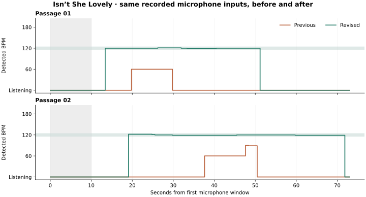

# Real microphone BPM measurements — 2026-09-26

The first tuning round used the physical lamp, FTDI A50285BI and music with a
user-supplied approximate reference of 120 BPM. No track identity, exact tempo or
beat-position annotations were available. These measurements show improvement on
this session's input; they are not a song-corpus accuracy benchmark.

## Capture and replay

A first 60-second raw ADC recording contained 16,350 samples, no invalid packets
and 1,369 missing audio batches. Its ADC range was 353–644. Subsampled raw capture
cannot reconstruct the detector's input windows reliably, even though it is
useful for examining the sensor waveform.

The added `LA` v2 diagnostic mode exports the exact peak-to-peak windows processed
by the detector, with their device timestamps and onset values. Four subsequent
60-second music captures each contained 5,770 windows (about 58 seconds after
serial-open/reset startup). The second had one missing window; the other three
had none. Both final hardware captures retained every window without CRC errors.
Final window spacing was 10–12 ms, with no growing backlog. LED snapshots continued
at approximately 25 Hz during diagnostics, similar to the original diagnostic
build; this does not directly measure LED refresh or flash-to-music phase error.

The same C++ `BeatTracker` runs in native replay, AVR firmware and WebAssembly.
Replay processes recorded windows, resets at gaps longer than 15 ms, and never
receives the reference BPM. The reference is only used to summarize output.
The legacy comparison uses the original detector with only a window replay entry
point added; it has its original gap handling. Results for the gapped second
recording should therefore be treated as approximate comparisons.

## Results

These percentages are measurement windows within **116–124 BPM**, excluding the
first ten seconds of each recording. Zero BPM means the detector is listening,
not locked. The first three recordings informed tuning. The fourth was collected
after the final algorithm was installed and was not used for further tuning.

| Real recording | Original detector replay near reference | Revised detector replay near reference | Revised BPM while locked |
| --- | ---: | ---: | --- |
| Music 1 | 4.5% | 64.3% | 119–121 |
| Music 2, one missing window | 0.0% | 91.9% | 120–123 |
| Music 3 | 0.0% | 69.1% | 120 |
| Fresh final recording | 0.0% | 36.6% | 122–124 |

The original detector also reported approximately 61 BPM for 44.6% of music 2 and
80 BPM for 6.0% of music 3. The revised replays had no locks outside the reference
band in these captures. On the fresh final recording, the physical lamp's telemetry
was within the reference band for **36.5%**, closely matching native replay; it
returned to listening during the other passages. This is a useful improvement,
but detection remains intermittent and should not be described as solved.

A separate 30-second recording with the music paused contained 2,780 windows, no
gaps and no BPM locks, both on the installed intermediate firmware and in final
replay. Twenty deterministic shuffles of music 1, preserving 50 ms sound bursts
but destroying their order, also produced no locks with the final detector.
These are limited negative controls, not proof against every kind of room noise.

## Changes supported by these measurements

- Compare all candidate lags against one common 384-window history slice, instead
  of moving the comparison endpoint during a scan.
- Combine evidence at a beat interval and twice that interval to handle alternating
  strong/weak hits. Keep supported candidates stable while acquiring and tracking.
- Allow weaker real-world correlation, but require peak prominence and persistence.
  Weak acquisition needs five scans; a clean strong signal can acquire after two.
- Use an adaptive onset floor for phase nudges. Release unsupported locks and
  prevent old periodic history from reacquiring during silence.
- Keep the diagnostic stream separate from lossy raw waveform capture. Preserve
  device timestamps and reset replay at missing windows.

The final firmware was uploaded and all **13,930 flash bytes** verified. Static
RAM is **1,168 bytes** of 2,048. Native tests, all 13 dashboard/protocol/WASM tests,
AVR compilation and the production dashboard build passed. Native regressions
include noisy input at multiple tempos, ADC/replay parity, dropped windows,
silence, tempo changes, full-scale input and timer rollover.

Full recordings remain local under Git-ignored `captures/`. The five window
captures are now preserved as compact [regression fixtures](../tests/fixtures/microphone/)
and replayed in CI; they contain timestamps and input peaks only. The original
fresh validation recording is now part of the regression suite, so future accuracy
evaluation needs new recordings. Reproduce a new
capture with the recorder/replay commands in the [README](../README.md#recording-real-microphone-data-for-bpm-tuning).
Future evaluation should use several known-tempo tracks and annotated beat times;
the current approximate reference cannot establish absolute tempo or phase accuracy.

## Second round: “Isn't She Lovely”

The user identified Stevie Wonder's “Isn't She Lovely” as a song the detector
struggled with, again supplying an approximate 120 BPM reference. Two separate
75-second sessions each captured 7,270 input windows (about 73 seconds after
serial-open startup), with 10–11 ms spacing, no missing windows and no rejected
packets. Both passages were used during tuning; neither is a held-out benchmark.

The previous firmware (`2fb167d`) never locked within 116–124 BPM in either
passage. It reported other tempos for 15.8% and 20.4% of evaluated windows,
including a 60 BPM half-tempo lock. This was a repeatable input-processing and
tracking problem, rather than missing diagnostic packets.

The revision smooths the measured envelope before extracting positive changes,
then scales each change relative to the envelope. A noise offset and deadband
limit amplification near silence. Acquisition accepts weaker correlation only
with longer evidence: ten confirmations for weak peaks, five for moderate peaks,
three for strong initial peaks. An isolated failed scan subtracts two
confirmations instead of discarding them all. Three failures still clear evidence.

Holding an established tempo requires less peak prominence than acquiring one
(1.5 versus 2 standard deviations above the lag-score background). Weak support
can keep the clock running, but period adjustments require a score of at least
25/100. This avoids drifting during ambiguous passages. No song name or reference
tempo is available to the detector, and its 60–200 BPM search range is unchanged.

| Recorded input | Previous near reference | Revised near reference | Revised wrong tempo |
| --- | ---: | ---: | ---: |
| Music 1 | 64.3% | 70.3% | 0.0% |
| Music 2 | 91.9% | 94.5% | 0.0% |
| Music 3 | 69.1% | 95.9% | 0.0% |
| Music 4 | 36.6% | 100.0% | 0.0% |
| Isn't She Lovely, passage 1 | 0.0% | 60.0% | 0.0% |
| Isn't She Lovely, passage 2 | 0.0% | 83.7% | 0.0% |

As above, results exclude the first ten seconds and use the user's approximate
reference ±4 BPM. The revised locked ranges are 119–121 and 119–122 BPM in the
new passages. It still returns to listening in parts of the song. These figures
measure tempo coverage, not whether each flash lands on the musical beat.

All original fixture thresholds remain unchanged. The two new fixtures require
at least 55% and 75% coverage, and at most 1% wrong-tempo locks. The quiet recording
and twenty seeded shuffles of real 50 ms sound bursts must never lock. These
negative controls rejected more eager candidate algorithms and are now run in CI.
The native tests across 60–200 BPM, weak/loud input, noisy rhythms, silence, missing
windows, tempo changes and rollover all pass, as do all 13 dashboard/protocol/WASM
tests and the production dashboard build.

The revised firmware uses **1,172 bytes of static RAM** and **14,130 bytes of
flash**, increases of 4 and 200 bytes. It was uploaded through FTDI A50285BI and
all flash bytes verified.
