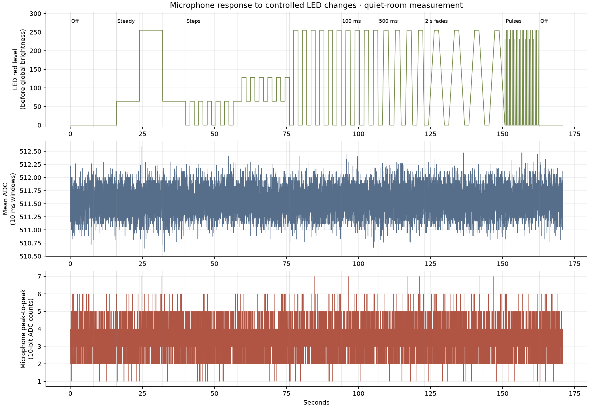
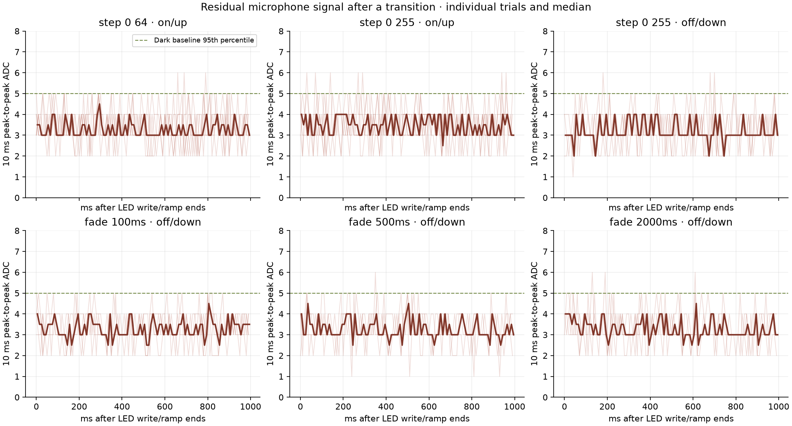

# LED/microphone coupling — 2026-09-27

**This controlled quiet-room test found no meaningful microphone disturbance from
the LEDs at the lamp's current brightness.** Abrupt steps, slow fades, and beat
pulses stayed close to the same noise floor as darkness. The earlier Radioactive
comparison suggested feedback, but used different musical passages. This new
measurement does not support treating LED electrical interference as the cause
of that BPM failure.

## Setup and data quality

The existing board, microphone on A0, 16-pixel strip, FTDI, and separate 5 V supply
were used. The user paused music and confirmed that the physical LEDs were visibly
changing during the test. The diagnostic drove a predetermined sequence without
using microphone input to control light output. It used production color
correction and global brightness **100/255**; “255” below is a program's red
channel value before that global scaling, not unrestricted maximum strip power.

The 170.803-second recording contains **293,060 ADC samples**, 162 transition
events, and 20,496 scheduled LED frames. There were **zero corrupt packets, missing
packets, or firmware buffer overflows**. Normal firmware was restored afterward,
with all 14,376 flash bytes read back and verified. Its SHA-256 is recorded with
the diagnostic firmware hash in the saved metadata.

Sampling targeted 2 kHz and retained actual timestamps: median spacing was
508 µs, maximum 2,164 µs. ADC reads pause during LED transmission and packet work;
these timing gaps were not filled with invented samples. The detector itself was
not running, so this diagnostic does not reproduce production's analysis-dependent
sampling cadence.

## What changed in the microphone readings?

Measurements use uncalibrated 10-bit ADC counts. RMS is variation around the mean
inside a 10 ms window; it is not calibrated sound pressure.

| Condition | Median AC RMS | Median peak-to-peak | 95th percentile peak-to-peak |
| --- | ---: | ---: | ---: |
| Dark, no LED data writes | 0.93 | 3 | 5 |
| Dark, 120 Hz LED data writes | 0.91 | 3 | 5 |
| Constant red, level 64 | 0.90 | 3 | 5 |
| Constant red, level 255 | 0.97 | 3 | 5 |
| Constant white, level 64 | 0.96 | 3 | 5 |
| Repeated brightness steps | 0.92–0.95 | 3 | 5 |
| During 100 ms fades | 0.93 | 3 | 5 |
| During 500 ms fades | 0.93 | 3 | 5 |
| During 2 s fades | 0.92 | 3 | 5 |
| 90 ms beat pulses every 500 ms | 0.92 | 3 | 5 |
| Dark after the sequence | 0.93 | 3 | 5 |

Median DC readings across steady conditions ranged only from **511.53 to 511.59**.
There was no substantial load-dependent bias shift or sustained noise increase.
Slower fades did not show a meaningful advantage over abrupt changes in this test.

## Settling after on/off and fades

There were 33 measured abrupt transitions (0↔64, 64↔128, 0↔255) and 24 fade
endpoints (100 ms, 500 ms and 2 s ramps, both directions). **All 57 were already
within the baseline band in the first 10 ms window after the LED write/ramp ended.**
No decay tail was resolved. This means “at baseline by our first 10 ms bin,”
not “the microphone physically takes 10 ms to settle.”

The baseline criterion was defined before examining the complete recording:
mean within ±max(3 counts, three robust standard deviations), and RMS no higher
than baseline +max(2 counts, three robust standard deviations), continuously for
100 ms and for at least 95% of the remaining observation. The final 400 ms of
each hold supplied its baseline, with an additional check that it was stable.
See the [analysis method](../experiments/led-microphone/README.md).

LED writes took 604–704 µs at the instrumented call sites. The first ADC sample
started 124–144 µs after each measured transition call returned. **Very short
transients during serialization are not observed**, and these software timestamps
do not directly measure current or the LEDs' physical latch time. This setup
cannot establish submillisecond settling or completely rule out coupling.

## What this suggests doing next

The follow-up [same-passage production-loop comparison](production-sampling-measurements.md)
is now complete. It found nearly identical input envelopes with steady and pulsed
LEDs, substantial variation between two steady takes, and a live/replay scheduling
gap. Its report gives the current next steps.

Do not add a long microphone blanking interval or slow the light fades on the
strength of the earlier correlation. This measurement gives neither change a
demonstrated benefit; blanking could remove actual musical attacks.

The next useful comparison is the **same music passage** with predetermined
steady versus flashing output, while recording the production ADC timestamps and
sample counts per detector window. That can distinguish changes in the input
from changes caused by sampling cadence and tempo estimation. Today's quiet-room
result cannot rule out interactions that occur only with music present, gain
compression/clipping, or different supply/wiring conditions. No new detector
filter or blanking rule was introduced from this experiment.

## Saved evidence and reproduction

- [Summary and per-transition results](measurements/led-microphone/summary.json)
- [Exact transition timestamps](measurements/led-microphone/events.json)
- [Compressed 10 ms measurements](measurements/led-microphone/windows.csv.gz)
- [Firmware, recorder, decoder tests and analysis](../experiments/led-microphone/)

Full ADC samples and serial traffic remain locally under
`captures/led-mic-quiet-01/`, ignored by Git. The repository retains derived
windows, events, plots, hashes, conditions and summary statistics. This is one
board/room session, not a general electrical specification.
