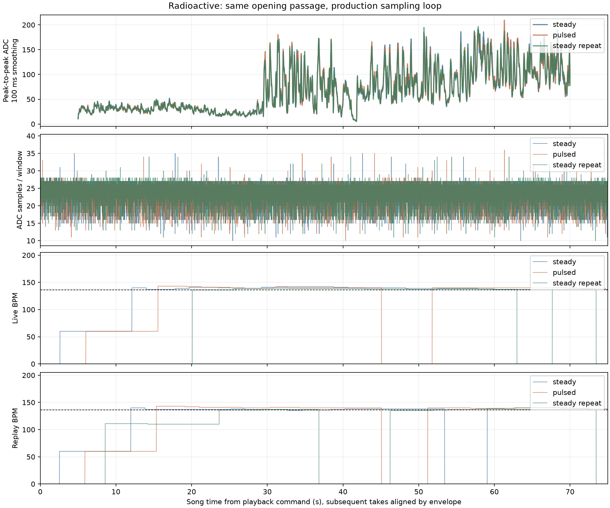

# Same-passage LED and microphone comparison — 2026-09-27

**Changing LED brightness is not the leading explanation for the BPM failures.**
Two steady-light recordings varied substantially in tempo acquisition despite
hearing essentially the same signal. Predetermined flashing produced a similarly
close microphone envelope. The stronger leads are the detector's uneven input
time base and its sensitivity to when deferred analysis work runs.

This is a measurement result, not an algorithm upgrade. Normal standalone
firmware was restored and its 14,376 flash bytes verified after every take.
Spotify was paused between recordings and after the final take; its volume
control remained at the observed value 1 throughout.

## Controlled comparison

The same opening of **Radioactive — Imagine Dragons**, Night Visions, Spotify
track `62yJjFtgkhUrXktIoSjgP2`, was played from 0:00 three times: steady red,
predetermined flashing, then steady red again. Music played only within capture
periods. Each recording includes paused pre/post-roll. Metrics below use song
seconds **15–70**, compared with the existing approximate **136 ±4 BPM** reference.

All takes ran the real production ADC loop, renderer, beat tracker and cooperative
work scheduler. A diagnostic override set final pixels to red 64 or red 255 for
90 ms every 500 ms, independently of detected beats. Normal global brightness
100/255 and color correction applied to both. Additional measurement work was
identical between conditions; it does change the loop's CPU cost relative to an
uninstrumented lamp.

The microphone envelopes aligned with correlations **0.9910** (flashing vs first
steady) and **0.9902** (steady repeat vs first steady), after shifts of −200 and
−340 ms relative to the UI playback timestamps. The measured signal stayed
comfortably inside the ADC range: no clipped windows. All three had median
peak-to-peak **64 counts**, with 95th percentiles approximately **168–169**.
These are smoothed-envelope correlations, not raw waveform correlations.

| Take | Live near reference | Live outside tolerance | Live unlocked | Replay near reference |
| --- | ---: | ---: | ---: | ---: |
| Steady | 72.3% | 27.7% | 0.0% | 82.9% |
| Flashing | 66.0% | 21.8% | 12.2% | 60.8% |
| Steady repeat | 82.3% | 0.0% | 17.7% | 67.2% |

The first steady take stayed at 137–142 BPM. The repeat took longer to lock but
then stayed at 136–140. Flashing included an early 60 BPM lock, a dropout, and
later estimates up to 143 BPM. A few BPM outside a tight tolerance should not be
confused with the earlier 96–108 BPM failure; that particular failure did not
recur here. The differences between two steady takes are enough that attributing
the flashing take's errors to electrical feedback would be unjustified.

## Timing and sampling findings

Across the three captures there are **27,181 complete detector windows**, with
zero corrupt packets, missing sequences, firmware buffer drops, or window gaps
over 15 ms. Each exported peak exactly matched the independently accumulated ADC
maximum minus minimum. There were **zero late LED frames** across 275 one-second
timing reports (120–121 frames per approximately one-second report). Maximum measured frame interval was
8,412 µs, maximum analysis chunk 576 µs, maximum instrumented input operation
508 µs, and minimum measured unused stack space 363 bytes.

The audio timing is less uniform than the LED timing:

- During the analyzed music passage, a detector window contained **10–36 ADC
  readings**; typical counts were 23–24, with 5th–95th percentiles of 16–27.
- The largest ADC gap was **3.04 ms**. Timestamps are conversion-end times and
  include gaps spanning window boundaries; the signal within those gaps is unknown.
- Nominal 10 ms windows averaged **10.126–10.148 ms** and sometimes lasted 13 ms.
  The tracker closes a window on the first available sample after its deadline,
  then starts its next interval from that delayed time.
- Tempo conversion still assumes exactly 10 ms per history entry. That mismatch
  alone would tend to bias a 136 BPM estimate upward by roughly **1.7–2.0 BPM**.
  This is an inference from the measured mean interval, not an explanation for
  every error or a claim that correcting it will solve tracking.

## Replay is not yet a faithful hardware model

**Every exported onset value reproduced exactly in native replay** for all three
takes. Nevertheless, BPM estimates diverged. The standard replay drains all
pending analysis work after each input window; real firmware spreads work around
LED deadlines, and some analysis crosses input-window boundaries. Its current
`--deferred` parity test drains the work immediately too, so that test does not
establish equivalence to actual hardware scheduling.

A coarse replay probe capped analysis at 8, 12, 16 or 28 work calls per window.
Changing only this budget changed tempo behavior on the same saved inputs. On
the flashing take, a 12-call budget matched live BPM within one beat/minute for
99.9% of the selected passage. No one fixed budget reproduced all three takes.
Work calls have different durations, so this is evidence of scheduling
sensitivity, not a cycle-accurate reproduction or exclusion of AVR/native
arithmetic differences.

## Next change

1. Make replay honor the lamp's execution schedule: record work-call counts and
   completion times per window, then replay those decisions. Keep immediate-drain
   tests, but label them correctly and add hardware-schedule fixtures.
2. Give the detector an explicit, consistent time base: stable window boundaries
   or tempo conversion using measured intervals. Quantify ADC sample-count effects
   separately; do not fill missing waveform samples with invented data.
3. Re-run the saved song regressions and a matched live passage, preserving the
   120 Hz LED deadline and measured stack margin. Only then evaluate changes to
   onset extraction or tempo scoring.

No microphone blanking, fade restriction, power rewiring or algorithm tuning was
introduced from this test. It covers one board, wiring arrangement, volume and
song passage. Like the earlier [quiet-room test](led-microphone-measurements.md),
it cannot rule out submillisecond disturbances hidden during LED transmission.

## Evidence and reproduction

- [Summary, hashes, playback times and timing metrics](measurements/production-sampling/summary.json)
- Compressed sampling statistics, detector windows, timing reports and replay
  outputs: [steady](measurements/production-sampling/steady/),
  [flashing](measurements/production-sampling/pulsed/),
  [steady repeat](measurements/production-sampling/steady-repeat/).
- [Firmware environments, recorder, decoder tests and analysis](../experiments/production-sampling/README.md).

Full serial captures and preserved firmware remain locally under
`captures/sampling-radioactive-*`, ignored by Git. The committed compressed
windows retain exact input values and timestamps for future replay. Existing
12-song/noise fixture checks retain their six documented expected failures;
no detection thresholds were relaxed for these new measurements.
