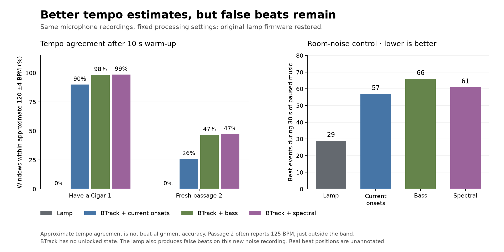

# BTrack comparison and measured audio features

This is an isolated research benchmark, not a replacement lamp program or a new
firmware dependency. It compares the current lamp tracker with unchanged upstream
[BTrack](https://github.com/adamstark/BTrack), first on the ten existing microphone
fixtures and then on regular 4 kHz samples from the actual lamp microphone.

## Findings (2026-09-26)

The recorded onset signal contains useful tempo information that our acquisition
logic rejects. Frequency information also helps, especially bass and complex
spectral difference, but these experiments do **not** produce a deployable detector:
the reference tracker emits beats in silence/noise and has a narrower tempo range.
The new paused-music capture also exposes false positives in the existing tracker.

Percentages below are time windows within the approximate reference ±4 BPM after
the first ten seconds. For BTrack they measure **tempo guesses**, not confident
locks: BTrack has no unlocked state. Wrong guesses fill the rest of its evaluated
time. These percentages do not measure musical beat alignment.

| Existing fixture | Lamp | BTrack, same lamp onsets |
| --- | ---: | ---: |
| Music 1 | 70.3% | 100.0% |
| Music 2 | 94.5% | 100.0% |
| Music 3 | 95.9% | 100.0% |
| Music 4 | 100.0% | 100.0% |
| Isn't She Lovely 1 | 60.0% | 84.9% |
| Isn't She Lovely 2 | 83.7% | 67.4% |
| Radioactive 1 | 0.0% | 75.8% |
| Radioactive 2 | 0.0% | 37.2% |
| Have a Cigar | 0.0% | 40.4% |

BTrack produced 53 beat events in the old room-noise recording, 145 in a 60-second
all-zero input, and 99–128 in each of twenty shuffled recordings. The lamp
produced none on those controls. Both trackers receive exactly the same onset
information; reference tempos are never supplied to either algorithm.

## Fresh physical audio comparison

The user played Pink Floyd's “Have a Cigar” on repeat, then paused playback for a
negative control. A separate [diagnostic firmware](../microphone-pcm/) recorded
regular ADC samples. Normal firmware was restored and verified after every capture.

| Recording | ADC samples | Duration | Gaps / rejected packets |
| --- | ---: | ---: | ---: |
| Have a Cigar 1 | 300,048 | 75.012 s | 0 / 0 |
| Have a Cigar 2, fresh passage | 300,384 | 75.096 s | 0 / 0 |
| Room noise, playback paused | 120,216 | 30.054 s | 0 / 0 |

All methods in each column below use the **same captured waveform**. The second
passage was evaluated with the feature recipes and tracker settings unchanged.
The lamp's normal polling cadence differs from this diagnostic sampling; these
are controlled replays, not live performance measurements with LEDs refreshing.

| Method | Have a Cigar 1 | Fresh passage 2 | Beat events in new paused-music capture |
| --- | ---: | ---: | ---: |
| Lamp tracker, peak-window onsets | 0.0% | 0.0% | 29 |
| BTrack, same peak-window onsets | 90.0% | 26.0% | 57 |
| BTrack, bass attacks | 98.4% | 46.7% | 66 |
| BTrack, mid attacks | 73.4% | 0.0% | 65 |
| BTrack, high attacks | 54.5% | 15.4% | 57 |
| BTrack, sum of three bands | 97.3% | 19.0% | 60 |
| BTrack, complex spectral difference | 98.6% | 47.4% | 61 |

The second spectral result needs careful interpretation: 40.6% of its evaluated
windows report **125 BPM**, just outside the 116–124 reference band. A wider
116–128 band would contain 92.3% of estimates, but that does not establish that
they are correct. The published score's approximate 120 BPM is not an annotation
of this performance. We have not changed the reference or existing test bounds.

The new paused-music replay is also a failure for the current lamp tracker: it
reports approximately 103 BPM for 69.8% of windows after warm-up. This control
contains real room sounds, not digital silence. It is retained alongside the music
features; the earlier passing quiet-room test does not cover it.



## Reproduce

Requires a C/C++ compiler, Git, and uv. Sources are downloaded into the CMake build
directory at pinned commits. No Homebrew libraries or global Python installs are
needed. Keep build output under `/tmp` or another ignored directory.

```sh
uv run --with cmake==4.4.3 cmake -S experiments/btrack-benchmark -B /tmp/lampe-btrack-build -DCMAKE_BUILD_TYPE=Release
uv run --with cmake==4.4.3 cmake --build /tmp/lampe-btrack-build --parallel 4
uv run --locked python experiments/btrack-benchmark/test_benchmark.py /tmp/lampe-btrack-build
uv run --locked python experiments/btrack-benchmark/compare.py /tmp/lampe-btrack-build/beat_benchmark --output captures/btrack-comparison
uv run --locked python experiments/btrack-benchmark/replay_features.py /tmp/lampe-btrack-build/beat_benchmark --output /tmp/feature-results.json
```

The three compressed [feature fixtures](recordings/) are about 404 KB total.
They preserve the 100 Hz peak measurements and all six onset streams, not tempo
outputs or musical audio. The current lamp onsets are recomputed and checked
against their stored values. These support repeatable **tracker** experiments.
Changing the audio filters requires the original local ADC recordings or new
captures; the spectral information cannot be recovered from onset features.

To regenerate features and plots from an original ADC capture:

```sh
MPLCONFIGDIR=/tmp/lampe-matplotlib uv run --locked --script experiments/btrack-benchmark/compare_audio.py captures/have-a-cigar-pcm-01 /tmp/lampe-btrack-build --reference-bpm 120 --output captures/new-audio-analysis
uv run --with numpy==2.5.3 --with scipy==1.18.1 python experiments/btrack-benchmark/test_audio.py /tmp/lampe-btrack-build
MPLCONFIGDIR=/tmp/lampe-matplotlib uv run --with matplotlib==3.11.2 python experiments/btrack-benchmark/plot_results.py
```

Omit `--reference-bpm` for room-noise inputs. The optional plotting dependencies
are isolated and locked in `compare_audio.py.lock`. Original ADC/serial captures
remain under Git-ignored `captures/`. Output directories must be new, to avoid
overwriting prior results. [Saved summaries](results/) include all three initial
tempo conditions, negative controls, dependency revisions and firmware hashes.
These experiments are deliberately outside the normal firmware/dashboard CI.

## Method and limitations

- BTrack revision `9d6127618a5679e9caa74c594b88f1d74f0e035f` (1.0.7), with its
  bundled Kiss FFT and libsamplerate 0.2.2 revision
  `c96f5e3de9c4488f4e6c97f59f5245f22fda22f7`. Upstream code is unmodified. Its
  GPL-3.0-or-later license and dependency notices remain in the fetched sources;
  this benchmark is not incorporated into the firmware or dashboard.
- `BTrack(441, 1024)` means 441/44100 = 10 ms per onset frame. Recorded onsets are
  held causally onto that clock; future values are never interpolated backwards.
  Gaps over 15 ms reset **both** trackers. Summaries include an additional metric
  excluding the warm-up after every gap, as a sensitivity check.
- BTrack starts at 120 BPM. Every experiment also runs with fixed initial guesses
  of 100 and 150 BPM, applied equally to every input, without fixing subsequent
  tempo. On fresh passage 1 spectral coverage is 95.1–98.6%; on passage 2 it is
  46.1–49.0%. The observed improvement is not just a retained 120 BPM default.
- The upstream 80–160 BPM model is unmodified. Synthetic 60, 173 and 200 BPM
  inputs demonstrate octave errors; 160 BPM is sensitive to initialization.
  This implementation cannot replace the lamp's 60–200 BPM contract directly.
- Bass/mid/high are causal second-order Butterworth bandpasses at 40–200,
  200–600 and 600–1800 Hz. Each uses trailing 10 ms RMS, `log1p(100 * RMS)` and
  positive changes. The combined feature is their unweighted sum. No filter
  settings were selected using the second passage.
- The spectral feature uses upstream `ComplexSpectralDifferenceHWR` with a
  trailing 128-sample Hann window (32 ms) and 40-sample hop at 4 kHz. An online
  DC estimate is removed first. The feature is fed to the same 100 Hz tracker;
  no audio resampling, centered windows or future audio are used.
- Four-kilohertz sampling only represents frequencies below 2 kHz without
  aliasing. The microphone's analog anti-alias filtering has not been measured.
  Regular sampling is verified through continuous packet indices, no ADC ring
  overflows and a host receive-rate sanity check, not an oscilloscope calibration.
- Synthetic 100/136 BPM tests check tempo, beat count and median beat timing
  below 30 ms. Real recordings lack independently annotated beat positions, so
  real flash alignment and end-to-end latency are **unmeasured**.

## Decision

Continue with a separate bass onset stream and a tracker that maintains tempo
alternatives, using spectral BTrack as a reference. Simple equal-weight mixing of
all bands is not supported by the fresh passage. Before deploying any alternative,
add a tested abstention mechanism for unsupported rhythms, preserve the full tempo
range, annotate real beat positions and measure timing with LEDs active. No new
detector was installed by this experiment; the current `9e0ffd4` firmware remains.

Research: [BTrack algorithm](https://dafx.de/paper-archive/2009/papers/paper_65.pdf),
[multiband meter analysis](https://researchportal.tuni.fi/en/publications/analysis-of-the-meter-of-acoustic-musical-signals/),
[FastLED interrupt constraints](https://github.com/fastled/fastled/wiki/interrupt-problems).
